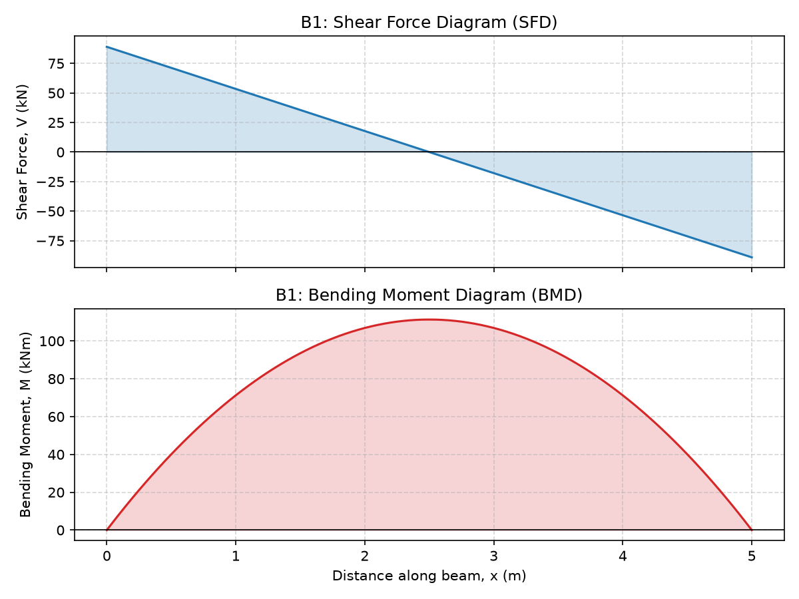
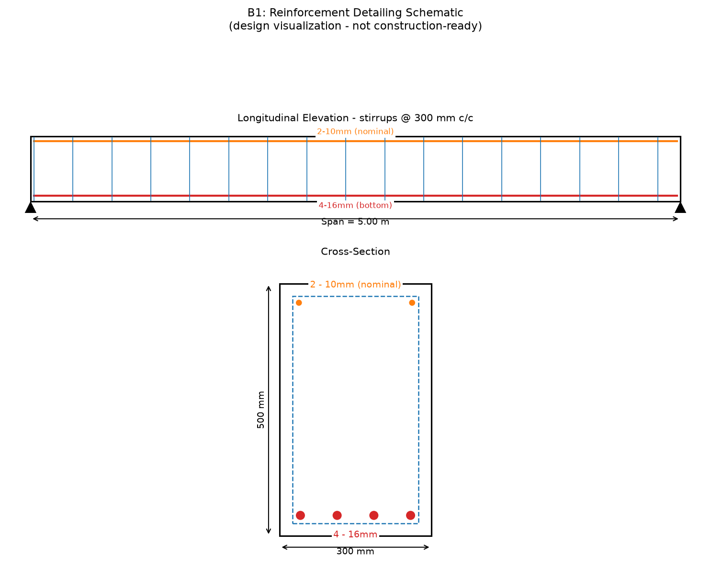

# RCC Beam Design & Verification Tool (IS 456:2000)

A Python-based reinforced concrete beam design engine implementing IS 456:2000
limit-state provisions - a Civil Engineering + software crossover project
combining a tested calculation core, an independent Excel verification
workbook, an interactive GUI, PDF reports, and a reinforcement detailing
schematic, all driven by the same design pipeline.

**Status: functionally complete for a simply supported beam under UDL.**
Load calculation, singly and doubly reinforced flexural design, shear design,
bar selection/optimization, development length, serviceability (deflection),
and reinforcement detailing are all implemented, tested, and cross-verified
across four independent outputs (terminal, Excel, GUI, PDF). See
[Roadmap](#roadmap) for what's built vs. what's still planned (additional
load cases and sensitivity analysis).

## Screenshots

**Shear force / bending moment diagram:**



**Reinforcement detailing schematic:**



**Interactive GUI:** see `docs/streamlit_screenshot.png` (add your own by
running `python -m streamlit run streamlit_app.py`, submitting a design, and
saving a screenshot there).

## Problem statement

Structural design tools are often either black-box commercial software or
spreadsheets with no audit trail. This project implements the IS 456:2000
design equations directly and transparently in Python, with an independent
Excel workbook for cross-checking, so every number in the output can be
traced back to a specific code clause.

## Project structure

```
rcc-beam-design-is456/
├── app/                # calculation engine
│   ├── materials.py    # concrete/steel grade constants (IS 456)
│   ├── loads.py        # load calculation, factored loads, Mu/Vu
│   ├── flexure.py       # singly + doubly reinforced flexural design (Annex G)
│   ├── shear.py         # shear design, vertical stirrups (Cl. 40)
│   ├── reinforcement.py  # effective depth, bar selection/optimization, Ld
│   ├── serviceability.py # deflection check, span/depth method (Cl. 23.2.1)
│   ├── diagrams.py       # SFD/BMD generation (matplotlib)
│   └── drawing.py        # reinforcement detailing schematic (matplotlib)
├── tests/               # pytest reference-example checks
├── excel/               # Excel verification workbook (build_workbook.py + generated .xlsx)
├── reports/             # generated PDF design reports (generate_report.py + generated .pdf)
├── drawings/             # reinforcement detailing schematics (generate_drawing.py + generated .png)
├── run_example.py        # scratch script: end-to-end demo
├── streamlit_app.py      # interactive GUI - inputs left, results right
├── generate_report.py    # PDF design report generator (ReportLab)
├── generate_drawing.py   # reinforcement detailing schematic generator
├── requirements.txt
└── README.md
```

## Roadmap

- [x] Repo scaffold
- [x] Load calculation (simply supported, UDL)
- [x] Flexural design - singly reinforced (IS 456 Annex G)
- [x] Shear design (tau_v, tau_c, stirrup spacing) - Cl. 40
- [x] Bar selection / optimization, spacing checks, development length
- [x] Serviceability (span/depth ratio, deflection) - Cl. 23.2
- [x] Doubly reinforced flexure design (Annex G-1.2)
- [x] SFD/BMD plots (matplotlib)
- [x] Excel verification workbook - Inputs, Load Calc, Flexural Design, Shear Design, Reinforcement, Serviceability, Design Summary dashboard
- [x] Streamlit GUI - interactive form (left) + live results, status badges, and SFD/BMD chart (right)
- [x] PDF report generation - 12-section design report (ReportLab), matches run_example.py/streamlit_app.py exactly
- [x] Reinforcement drawing schematic - longitudinal elevation + cross-section, bar counts/diameters/spacing, stirrup ticks, dimensions (design visualization, not construction-ready)
- [ ] Additional load cases (point loads, cantilever, continuous), sensitivity analysis

## IS 456 provisions implemented so far

| Check | Clause | Module |
|---|---|---|
| Load factor (1.5 DL + 1.5 LL) | Table 18 / Cl. 36.4.1 | `app/loads.py` |
| Limiting moment of resistance, Mu,lim | Annex G-1.1(c), Cl. 38.1 | `app/flexure.py` |
| Required tension steel, Ast | Annex G-1.1(b) | `app/flexure.py` |
| Minimum tension steel, Ast,min | Cl. 26.5.1.1(a) | `app/flexure.py` |
| Maximum tension steel, Ast,max | Cl. 26.5.1.1(b) | `app/flexure.py` |
| Compression steel design, doubly reinforced | Annex G-1.2 | `app/flexure.py` |
| Design stress in compression steel, fsc | SP:16 design aid | `app/flexure.py` |
| Nominal shear stress, tau_v | Cl. 40.1 | `app/shear.py` |
| Design shear strength, tau_c | Table 19, Cl. 40.2.1 | `app/shear.py` |
| Maximum shear stress, tau_c,max | Table 20, Cl. 40.2.3 | `app/shear.py` |
| Stirrup design / minimum shear reinforcement | Cl. 40.3, 40.4 | `app/shear.py` |
| Maximum stirrup spacing | Cl. 26.5.1.5 | `app/shear.py` |
| Effective depth derivation | Cl. 25.4 | `app/reinforcement.py` |
| Minimum clear bar spacing | Cl. 26.3.2 | `app/reinforcement.py` |
| Development length, Ld | Cl. 26.2.1, 26.2.1.1 | `app/reinforcement.py` |
| Span/depth deflection check | Cl. 23.2.1, Fig. 4/5/6 | `app/serviceability.py` |

## Installation

```bash
python -m venv .venv
.venv\Scripts\activate
pip install -r requirements.txt
```

## Usage (current milestone)

```bash
python run_example.py
```

## Running the GUI

```bash
python -m streamlit run streamlit_app.py
```

Opens an interactive form (span, dimensions, grades, loads) on the left;
clicking **DESIGN BEAM** runs the same engine as `run_example.py` and shows
the moment/shear/reinforcement/serviceability results, SAFE/FAIL status, and
the SFD/BMD chart on the right.

## Generating a PDF report

```bash
python generate_report.py
```

Creates `reports/Beam_Design_<name>.pdf` - a 12-section report (design
parameters, materials, loads, moment/shear, flexural design, shear design,
reinforcement, serviceability, an IS 456 compliance table, a final summary
with SAFE/FAIL status, and the SFD/BMD chart), using the exact same
calculation engine as `run_example.py` and `streamlit_app.py`.

## Generating a reinforcement drawing

```bash
python generate_drawing.py
```

Creates `drawings/Beam_Drawing_<name>.png` - a longitudinal elevation and
cross-section showing bar count/diameter, stirrup spacing, cover, and
dimensions, using the same design pipeline as the other tools. For a singly
reinforced section it draws two nominal 10mm hanger bars at the top (a real
detailing practice to hold the stirrups - not a strength requirement); for a
doubly reinforced section it draws the actual calculated compression steel
instead. This is a design visualization, not a construction-ready drawing -
it omits lap lengths, bend details, curtailment, and a bar bending schedule.

## Running tests

```bash
python -m pytest -q
```

## Validation

Each module's tests cross-check the implementation against hand-calculated
values using the plain IS 456 formulas (see docstrings in `tests/`).

The Excel workbook (`excel/RCC_Beam_Design.xlsx`, generated by
`excel/build_workbook.py`) independently recomputes the same checks using
native Excel formulas (not values copied from Python) - its Design Summary
sheet reports SAFE and matches `run_example.py`'s output exactly for the
same beam.

## Limitations (current milestone)

- Simply supported beams with UDL only (no point loads, cantilever, or
  continuous beams yet).
- Doubly reinforced flexure design implemented, but only single-layer
  compression steel (one d' value) - no multi-layer compression arrangements.
- Shear design covers vertical stirrups only (no bent-up bars).
- Bar selection searches single-layer arrangements only (2-6 bars, one
  diameter) - no two-layer or mixed-diameter arrangements yet.
- Nominal cover is a direct input (mild-exposure assumption in the example);
  it is not yet looked up from exposure condition per Table 16.
- Deflection check uses the simplified span/depth method only (no direct
  deflection calculation); flanged-beam factor kf is fixed at 1.0
  (rectangular sections only).
- No crack-width or ductile-detailing (IS 13920) checks yet.
- The reinforcement drawing is a schematic (bar count/diameter/spacing to
  approximate scale) for review purposes only - not construction-ready
  (no lap lengths, bend/hook details, curtailment, or bar bending schedule).
